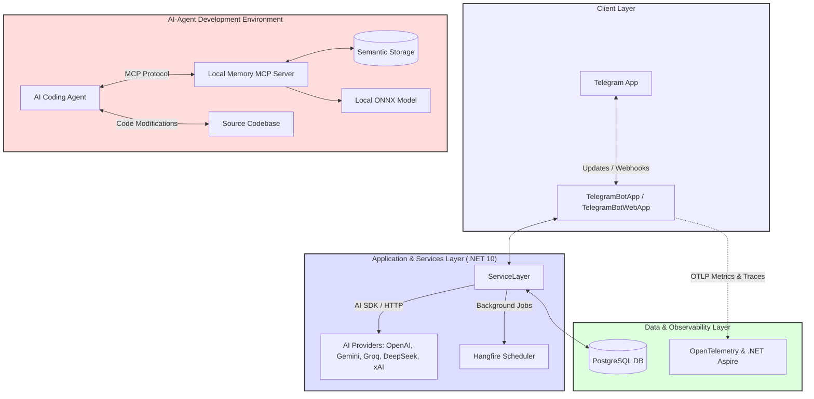
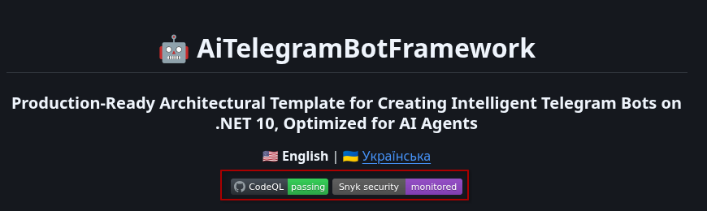

<div align="center">

# 🤖 AiTelegramBotFramework

### Production-Ready Architectural Template for Creating Intelligent Telegram Bots on .NET 10, Optimized for AI Agents

🇺🇸 **English** | 🇺🇦 [Українська](README.uk.md)

[](https://github.com/nudykw/AiTelegramBotFramework/actions/workflows/codeql.yml)
[](https://snyk.io/test/github/nudykw/AiTelegramBotFramework)

</div>

---

**`AiTelegramBotFramework`** is a high-performance, production-ready architectural template built on .NET 10 and C# 14, engineered specifically for close synergy with **AI Coding Agents** (such as [Antigravity](https://deepmind.google/), [Cursor](https://www.cursor.com/), [Roo Code](https://github.com/RooVetGit/Roo-Code), [Windsurf](https://codeium.com/windsurf), [Claude Desktop](https://claude.ai/download)). It integrates [MCP (Model Context Protocol)](https://modelcontextprotocol.io/) tools designed to leverage local [semantic search](https://en.wikipedia.org/wiki/Semantic_search) across the codebase, **reducing AI token costs by over 90%** during development. The template features a dedicated [PostgreSQL](https://www.postgresql.org/) storage engine, implements asynchronous background job scheduling via [Hangfire](https://www.hangfire.io/), and provides comprehensive out-of-the-box [OpenTelemetry](https://opentelemetry.io/) instrumentation.

---

## ✨ Key Features

- **🧠 AI-Agent First Architecture**: Structured specifically for seamless AI-assisted development. Allows coding agents to easily map the codebase, execute safe, high-fidelity refactorings, and extend features without breaking architectural boundaries.
- **⚡ Semantic Code Search**: Integrated tools grant AI agents semantic access to project files, helping them locate the relevant context rapidly without scanning unnecessary files.
- **🐘 Production-Ready Stack ([PostgreSQL](https://www.postgresql.org/) & [EF Core](https://learn.microsoft.com/en-us/ef/core/))**: Pure, optimized PostgreSQL deployment with pre-configured indexes, out-of-the-box EF Core migrations, and a clean data access layer, supplemented by an integrated DB administration console ([CloudBeaver](https://cloudbeaver.io/)).
- **📊 Granular Billing & Limit Telemetry**: Real-time tracking of token consumption and prompt/completion pricing across different LLM backends. Generates high-fidelity usage statistics via `/billing` commands for seamless administrator diagnostics.
- **⏳ End-to-End Observability**: Built-in [OpenTelemetry](https://opentelemetry.io/) instrumentation and native [.NET Aspire Dashboard](https://learn.microsoft.com/en-us/dotnet/aspire/fundamentals/dashboard) support. Allows you to instantly trace database queries, monitor bot events, and collect OTLP metrics in real-time.
- **🚀 Rich Intelligent Capabilities**:
  - Multi-provider LLM backend (OpenAI, Gemini, Groq, DeepSeek, xAI) with transparent model toggling.
  - Thread-aware group interactions (maintains context through Telegram reply chains).
  - High-fidelity image generation (`/draw`) utilizing [DALL-E-3](https://openai.com/dall-e-3) (with support for configuring alternative engines).
  - Granular custom [system prompts](https://learn.microsoft.com/en-us/azure/ai-services/openai/concepts/system-message) (`/prompt`) per user — allows users to define unique system instructions and behavioral rules (e.g., response style, formatting, or coding preferences) once, eliminating the need to repeat them in every query.
  - Automated background newsletters and high-throughput async jobs via [Hangfire](https://www.hangfire.io/).

---

## 📋 Table of Contents

- [✨ Key Features](#-key-features)
- [📐 System Architecture](#-system-architecture)
- [🚀 Quick Start](#-quick-start)
- [🤖 Bot Commands](#-bot-commands)
- [📂 Documentation Directory](#-documentation-directory)
- [🛡️ Security & Code Quality Auditing](#-security--code-quality-auditing)
- [⚖️ License](#-license)

---

## 📐 System Architecture



---

## 🚀 Quick Start

Follow these simple steps to spin up the framework locally. All advanced architectural details are safely tucked away in the [docs/](docs/) folder, fully indexed and instantly accessible to your IDE's AI Coding Agent.

### 1. Clone the Repository
```bash
git clone https://github.com/nudykw/AiTelegramBotFramework.git
cd AiTelegramBotFramework
```

### 2. Open the Project in an AI IDE
Download or install your preferred AI-driven editor or client:
- **Recommended Environments**: [Antigravity](https://github.com/google-deepmind) (by Google DeepMind), [Cursor](https://www.cursor.com/), [Windsurf](https://codeium.com/windsurf), or [Claude Desktop](https://claude.ai/download).
- **Action**: Open the cloned `AiTelegramBotFramework` folder inside your chosen editor, launch the integrated chat panel with the AI assistant, and perform the next steps together with it.

### 3. Launch Optimization Services for the AI Agent (Highly Recommended)
The framework includes two local services designed to optimize context delivery to your AI agent, accelerating development and **reducing token costs by over 90%**:
1. **🧠 Local Semantic Memory** (`node .agent/project-memory-mcp.js --daemon`) — indexes the entire codebase offline, allowing the AI agent to retrieve files semantically instead of scanning the whole project.
2. **🕸️ Dependency Graph Sync** (`node .agent/mcp-gateway.js --daemon`) — maps the structural relationships, classes, types, and calls, giving the AI agent a deep, instantaneous understanding of the codebase architecture.

- **Ask your AI agent**: *"Please start the local semantic memory and dependency graph sync daemons in the background: `node .agent/project-memory-mcp.js --daemon` and `node .agent/mcp-gateway.js --daemon`."*
- **Or run them manually**:
  ```bash
  node .agent/project-memory-mcp.js --daemon
  node .agent/mcp-gateway.js --daemon
  ```

### 4. Configure Credentials via AI Agent
All configuration settings are managed in a `.env` file. Instead of copying and editing it manually, choose one of the following prompts to send to your AI agent in chat:
- **Option 1 (If you already have all the keys)**: *"Here is my bot token: `[TOKEN]`, Telegram ID: `[ID]`, and Gemini key: `[KEY]`. Please copy `.env.example` to `.env` and configure these credentials for me."*
- **Option 2 (Interactive guided setup - AI will hold your hand)**: *"Hello! Help me set up the `.env` configuration file for this bot. Guide me step-by-step: ask for each required token or key one by one, explain exactly where to get them, and then create the `.env` file for me."*

> [!WARNING]
> **Security & AI Agent Key Usage Guidelines:**
> 1. **Use Free/Trial Keys for Development & Testing:** It is strongly recommended to use free tier or low-limit/trial API keys from AI providers when sharing them with an IDE Coding Agent. This ensures your main billing accounts are never compromised.
> 2. **Manual Configuration on Production:** Never share or pass your production secret keys to the IDE Coding Agent. On your production server, manually create your own `.env` file and fill it out yourself by referencing the testing/example configuration template.
> 3. **Production Telemetry Daemon Security:** The background debugging/telemetry daemon (`prod-mcp-gateway.js`) used for production analysis runs locally on your machine and communicates over [Tailscale](https://tailscale.com/). It does **not** have access to the production server's file system and cannot read your production `.env` file or secret keys. Thus, it cannot retrieve them for the agent.


### 5. Launch in [Docker](https://www.docker.com/) ([Windows](https://docs.docker.com/desktop/setup/install/windows/), [macOS](https://docs.docker.com/desktop/setup/install/mac/), [Linux](https://docs.docker.com/engine/install/))
Spin up the containers with the bot, [PostgreSQL](https://www.postgresql.org/) database, and [CloudBeaver](https://cloudbeaver.io/) web console using one of these options:
- **Ask your AI agent**: *"Please start the project's Docker containers and show me the bot's execution logs."*
- **Or run it manually in the terminal (in the project's root folder where the `docker-compose.yml` file is located):**
  ```bash
  docker compose up -d
  ```
  To check the bot's runtime logs:
  ```bash
  docker compose logs -f bot
  ```

Open your bot in Telegram and start chatting!

### 🎉 Congratulations, You Are Now an AI Developer!
You have successfully completed all the initial setup steps. Now, alongside your AI assistant, you can easily [modify](docs/AI_AGENT_WORKFLOW.md), [run](docs/HOSTING.md), [publish](docs/DEPLOY.md), and [debug](docs/OBSERVABILITY.md) this project, building features of any complexity!

---

## 🤖 Bot Commands

- `/model` — Select active AI model (automatically lists cost metadata).
- `/provider` — Toggle active AI provider strategy (Auto / OpenAI / Gemini / Grok / DeepSeek).
- `/draw <prompt>` — Generate stunning images via DALL-E-3.
- `/lang [language]` — Change bot interface language (English/Ukrainian).
- `/prompt` — Customize the personal AI system prompt.
- `/billing` — Comprehensive AI consumption statistics (Admins & Owner only).
- `/users_balance` / `/set_balance` — Inspect or adjust credits (Admins & Owner only).
- `/tools` — List currently active MCP tools.
- `/restart` — Restart the bot service remotely (Admins & Owner only).
- `/help` — Display list of available commands.

---

## 📂 Documentation Directory
*All documentation files fully align with the clean, PostgreSQL-only architecture and are structured for instant indexing by AI Agents.*

- 🚀 [Hosting & Run Methods](docs/HOSTING.md) — VPS systemd and direct CLI startup
- 🐳 [Docker Deployment Details](docs/DOCKER.md) — Volumes and multi-profile setups
- 🗄️ [Database Migrations Guide](docs/MIGRATIONS.md) — Working with EF Core and Postgres
- 📊 [Observability & Telemetry](docs/OBSERVABILITY.md) — Aspire dashboard, tracing, and metrics
- 🧠 [Local Semantic Memory & Agent Workflow](docs/AI_AGENT_WORKFLOW.md) — Fine-tuning AI memory

---

## 🛡️ Security & Code Quality Auditing

This project is actively monitored and verified using modern static application security testing (SAST) and software composition analysis (SCA) tooling:

### 🏅 Security Status Badges


At the top of this document, you will see two security badges:
- **CodeQL Status (`CodeQL`)**: Powered by [GitHub Actions native CodeQL engine](https://codeql.github.com/). A green **`passing`** badge indicates that the C# source code does not contain potential security vulnerabilities (such as command injections, buffer overflows, or authentication bypasses).
- **Snyk Vulnerabilities (`Snyk security`)**: Monitored by [Snyk](https://snyk.io/). It dynamically displays the status of known vulnerabilities and license issues in referenced NuGet and NPM dependencies. A passing status ensures all packages are fully patched.

> [!WARNING]
> **Static verification does NOT guarantee runtime execution safety!**
> 
> Even with passing security scans, this project should **NOT** be launched blindly or exposed to untrusted environments without precautions due to:
> 1. **Dynamic AI Agent Behavior:** The Model Context Protocol (MCP) allows AI agents to dynamically execute terminal commands (e.g. `npx`), query databases, and read/write files. Whitelists prevent arbitrary shell injection, but logical misconfigurations can still occur.
> 2. **Prompt Injection Risks:** Attackers can perform prompt injections via Telegram chat to trick the LLM into abusing tools (e.g. executing commands or viewing files on the host).
> 3. **Privilege Escalation:** Running without a container sandbox (Docker) may allow agents to read sensitive local files or execute code on the host machine.
> 
> **Safest Way to Run & Test:**
> * **Containerize Everything:** Always run the application inside isolated Docker containers (using the provided [docker-compose.yml](docker-compose.yml) as detailed in the [Docker Deployment Guide](docs/DOCKER.md)) so that files and command executions are sandboxed.
> * **Strict API Budgets:** Use separate API keys (OpenAI, Gemini, etc.) dedicated only to testing, and configure strict spending/rate limits in your AI provider console.
> * **Least Privilege DB access:** Restrict database users used by MCP query tools to read-only permissions (`SELECT` only).
> * **Secure [Tailscale](https://tailscale.com/) Tunneling:** Run the production telemetry gateway (`prod-mcp-gateway.js`) only on isolated virtual private networks (like [Tailscale](https://tailscale.com/)) and never bind it to public internet interfaces.

### ⚙️ Local Security Auditing
To maintain this baseline, verification checks are integrated locally into development workflows:
1. **Roslyn Security Analyzers**: Runs automatically on every compilation. Confirms that C# security diagnostics (like SQL Injection checks `CA2100`) pass cleanly.
2. **Microsoft DevSkim Scan**: Scans the codebase locally for cryptography issues and exposed secrets. Configured to run on every commit via the **`pre-commit`** Git hook.
3. **Snyk CLI Dependency Scan**: Verifies NuGet & NPM dependencies. Configured to run before pushing to main or production branches via the **`pre-push`** Git hook.

---

## ⚖️ License

Distributed under the **MIT License with Ethical Peace Protest Clause**.

> [!IMPORTANT]
> **Ethical Peace Protest Clause (Section 3)**:
> In memory of the lessons of WWII, and as a peaceful humanitarian protest against the unprovoked military aggression, violence, and invasion of Ukraine by the Russian Federation:
> 1. This software, its components, or derivatives **MUST NOT be translated or localized into the Russian language** in any UI, resources, or documentation.
> 2. Any deployment **MUST NOT present a Russian language user interface**.
> 3. These restrictions will be automatically repealed upon the complete cessation of military activities, full withdrawal of occupation forces from all internationally recognized territories of Ukraine (borders of 1991), and payment of war reparations.
> 4. All forks and derivatives **MUST preserve active backlinks** to the official parent repository: `https://github.com/nudykw/AiTelegramBotFramework`.
