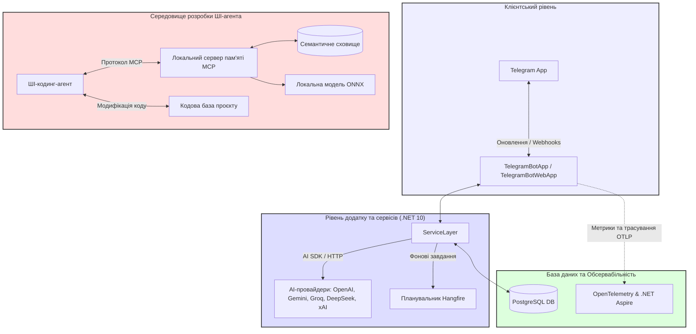

<div align="center">

# 🤖 AiTelegramBotFramework

### Стартовий шаблон для розробки Telegram-ботів на .NET 10, оптимізований для роботи з ШІ-агентами

🇺🇸 [English](README.md) | 🇺🇦 **Українська**

[](https://github.com/nudykw/AiTelegramBotFramework/actions/workflows/codeql.yml)
[](https://snyk.io/test/github/nudykw/AiTelegramBotFramework)

</div>

---

**`AiTelegramBotFramework`** — це сучасний стартовий шаблон на базі .NET 10 та C# 14, спроєктований для зручної розробки Telegram-ботів у тісній синергії з **ШІ-кодинг-агентами** ([Antigravity](https://deepmind.google/), [Cursor](https://www.cursor.com/), [Roo Code](https://github.com/RooVetGit/Roo-Code), [Windsurf](https://codeium.com/windsurf), [Claude Desktop](https://claude.ai/download)). Він інтегрує інструменти [MCP (Model Context Protocol)](https://modelcontextprotocol.io/) для роботи з локальним [семантичним пошуком](https://en.wikipedia.org/wiki/Semantic_search) по коду, що дозволяє **економити понад 90% витрат на токени**, повністю налаштований для роботи з [PostgreSQL](https://www.postgresql.org/), підтримує асинхронні фонові завдання через [Hangfire](https://www.hangfire.io/) та інтегрується з [OpenTelemetry](https://opentelemetry.io/).

---

## ✨ Ключові особливості

- **🧠 ШІ-орієнтована архітектура (AI-Agent First)**: Структура проєкту спроєктована таким чином, щоб ШІ-агенти могли легко аналізувати кодову базу, безпечно вносити зміни, розширювати функціонал і проводити рефакторинг без порушення цілісності архітектури.
- **⚡ Семантичний пошук по коду**: Інтегровані інструменти надають ШІ-агенту семантичний доступ до файлів проєкту, допомагаючи йому швидше знаходити потрібний контекст без зчитування зайвих файлів.
- **🐘 СУБД [PostgreSQL](https://www.postgresql.org/) та [EF Core](https://learn.microsoft.com/en-us/ef/core/)**: Архітектура повністю орієнтована на PostgreSQL. Включає оптимізовані індекси, готові EF Core міграції, надійний шар доступу до даних та інтегрований веб-інтерфейс адміністрування бази даних ([CloudBeaver](https://cloudbeaver.io/)).
- **📊 Розширений білінг та облік лімітів**: Детальний моніторинг споживання токенів, підрахунок вартості запитів до різних LLM-провайдерів у реальному часі та гнучке управління балансом користувачів за допомогою зручних адміністративних команд (наприклад, `/billing`).
- **⏳ Наскрізна обсервабільність (Advanced Observability)**: Глибока інтеграція з [OpenTelemetry](https://opentelemetry.io/) та [Dashboard .NET Aspire](https://learn.microsoft.com/en-us/dotnet/aspire/fundamentals/dashboard). Трасування запитів до бази даних, моніторинг подій Telegram-бота та OTLP-метрики доступні прямо "з коробки" для повного контролю за станом системи.
- **🚀 Функціональні можливості**:
  - Мультипровайдерний ШІ-бекграунд (OpenAI, Gemini, Groq, DeepSeek, xAI).
  - Контекстні розмови у групах та гілках (збереження контексту через ланцюжки відповідей/replies).
  - Генерація зображень (`/draw`) через [DALL-E-3](https://openai.com/dall-e-3) (з можливістю налаштування будь-якого іншого генератора).
  - Персональні [системні промпти](https://learn.microsoft.com/uk-ua/azure/ai-services/openai/concepts/system-message) (`/prompt`) — дозволяють кожному користувачу задати боту унікальні інструкції та правила поведінки (наприклад, стиль відповідей чи правила кодингу), щоб не повторювати їх у кожному запиті.
  - Голосовий синтез та розпізнавання мовлення.
  - Асинхронне планування завдань та фонові розсилки на базі [Hangfire](https://www.hangfire.io/).

---

## 📐 Архітектура системи



---

## 🚀 Швидкий старт

Виконайте ці прості кроки для локального запуску фреймворку. Всі глибокі деталі архітектури надійно сховані в каталозі [docs/](docs/), повністю проіндексовані та миттєво доступні для ШІ-агента вашої IDE.

### 1. Клонування репозиторію
```bash
git clone https://github.com/nudykw/AiTelegramBotFramework.git
cd AiTelegramBotFramework
```

### 2. Відкриття проєкту у ШІ-середовищі розробки
Завантажте або встановіть за допомогою пакетного менеджера обраний вами ШІ-агент / середовище розробки:
- **Рекомендовані середовища**: [Antigravity](https://github.com/google-deepmind) (від Google DeepMind), [Cursor](https://www.cursor.com/), [Windsurf](https://codeium.com/windsurf) або [Claude Desktop](https://claude.ai/download).
- **Дія**: Відкрийте у встановленому середовищі клоновану папку проєкту `AiTelegramBotFramework`, запустіть вбудований чат з ШІ-асистентом та виконуйте наступні кроки разом із ним.

### 3. Запуск сервісів оптимізації для ШІ-агента (Наполегливо рекомендовано)
Фреймворк містить два локальних сервіси, які оптимізують передачу контексту вашому ШІ-агенту, забезпечуючи швидкість розробки та **економію понад 90% витрат на токени**:
1. **🧠 Локальна семантична пам'ять** (`node .agent/project-memory-mcp.js --daemon`) — індексує весь проєкт офлайн, дозволяючи ШІ-агенту семантично знаходити потрібні файли замість читання всього коду.
2. **🕸️ Синхронізація графа залежностей** (`node .agent/mcp-gateway.js --daemon`) — будує структурну карту проєкту (класи, методи, типи та зв'язки), надаючи ШІ-агенту повне розуміння архітектури.

- **Запит до вашого ШІ-агента**: *"Запусти сервіси семантичної пам'яті та графа залежностей проєкту у фоновому режимі: `node .agent/project-memory-mcp.js --daemon` та `node .agent/mcp-gateway.js --daemon`."*
- **Або ручний запуск**:
  ```bash
  node .agent/project-memory-mcp.js --daemon
  node .agent/mcp-gateway.js --daemon
  ```

### 4. Налаштування облікових даних за допомогою ШІ-агента
Всі конфігурації оточення керуються через файл `.env`. Замість ручного копіювання та редагування, виберіть один із варіантів запиту до вашого ШІ-агента в чаті:
- **Варіант 1 (Якщо у вас вже є всі ключі)**: *"Ось мій токен бота: `[TOKEN]`, мій Telegram ID: `[ID]` та ключ Gemini: `[KEY]`. Створи для мене файл `.env` на основі прикладу `.env.example` та впиши туди ці дані."*
- **Варіант 2 (Інтерактивний покроковий гід - ШІ проведе вас за руку)**: *"Привіт! Допоможи мені налаштувати конфігураційний файл `.env` для цього бота. Запитай у мене по черзі всі необхідні токени та ключі, розкажи, де саме мені їх отримати, а після цього самостійно створи для мене цей файл."*

> [!WARNING]
> **Правила безпеки при роботі з ШІ-агентом та ключами:**
> 1. **Використовуйте безкоштовні/тестові ключі для розробки:** Настійно рекомендується використовувати безкоштовні або лімітовані тестові API-ключі провайдерів ШІ під час передачі їх ШІ-агенту в IDE. Це гарантує безпеку ваших основних платіжних акаунтів.
> 2. **Ручне налаштування на продакшені (Production):** Ніколи не передавайте робочі (продові) секретні ключі ШІ-агенту. На продакшн-сервері необхідно створити файл `.env` вручну та заповнити його самостійно, орієнтуючись на приклад конфігурації тестування.
> 3. **Безпека допоміжного демона відлагодження:** Допоміжний демон для відлагодження продакшену (`prod-mcp-gateway.js`) запускається локально на вашому комп'ютері та працює через мережу Tailscale. Він **не має доступу** до файлової системи продакшн-сервера та не може прочитати ваш робочий файл `.env` чи секретні ключі. Відповідно, он не зможе передати їх ШІ-агенту.


### 5. Запуск у [Docker](https://www.docker.com/) ([Windows](https://docs.docker.com/desktop/setup/install/windows/), [macOS](https://docs.docker.com/desktop/setup/install/mac/), [Linux](https://docs.docker.com/engine/install/))
Запустіть контейнери з ботом, базою даних [PostgreSQL](https://www.postgresql.org/) та веб-консоллю [CloudBeaver](https://cloudbeaver.io/) одним із способів:
- **Запит до вашого ШІ-агента**: *"Запусти Docker-контейнери проєкту та виведи мені лог роботи бота."*
- **Або ручний запуск у терміналі (в кореневій папці проєкту, де знаходиться файл `docker-compose.yml`):**
  ```bash
  docker compose up -d
  ```
  Для перевірки логів роботи бота:
  ```bash
  docker compose logs -f bot
  ```

Відкрийте діалог з вашим ботом у Telegram та почніть спілкування!

### 🎉 Вітаємо, ви — ШІ-розробник!
Ви успішно завершили всі кроки первинного налаштування. Тепер за допомогою ШІ-асистента ви можете легко [модифікувати](docs/AI_AGENT_WORKFLOW.uk.md), [запускати](docs/HOSTING.uk.md), [публікувати](docs/DEPLOY.uk.md) та [відлагоджувати](docs/OBSERVABILITY.uk.md) цей проєкт, створюючи рішення будь-якої складності!

---

## 🤖 Команди бота

- `/model` — Вибір активної моделі ШІ (автоматично показує метадані вартості).
- `/provider` — Перемикання ШІ-провайдерів (Auto / OpenAI / Gemini / Grok / DeepSeek).
- `/draw <промпт>` — Генерація зображень через DALL-E-3.
- `/lang [мова]` — Зміна мови інтерфейсу бота (English/Ukrainian).
- `/prompt` — Налаштування персонального системного промпту ШІ.
- `/billing` — Детальна статистика споживання токенів (Тільки для власника та адмінів).
- `/users_balance` / `/set_balance` — Перегляд та коригування балансів (Тільки для власника та адмінів).
- `/tools` — Перелік активних інструментів MCP.
- `/restart` — Дистанційний перезапуск сервісу бота (Тільки для власника та адмінів).
- `/help` — Відобразити список доступних команд.

---

## 📂 Структура документації
*Всі матеріали документації повністю приведені у відповідність до PostgreSQL-only архітектури та детально структуровані для миттєвої індексації ШІ-агентами.*

- 🚀 [Методи хостингу та запуску](docs/HOSTING.uk.md) — робота через systemd та запуск з CLI
- 🐳 [Деталі розгортання в Docker](docs/DOCKER.uk.md) — томи даних та комбіновані профілі
- 🗄️ [Керівництво з міграцій бази даних](docs/MIGRATIONS.uk.md) — робота з міграціями EF Core та PostgreSQL
- 📊 [Моніторинг та телеметрія](docs/OBSERVABILITY.uk.md) — робота з Aspire dashboard та OTel
- 🧠 [Локальна семантична пам'ять (MCP)](docs/AI_AGENT_WORKFLOW.uk.md) — оптимізація витрат та економія контексту

---

## 🛡️ Безпека та верифікація коду

Цей проєкт активно контролюється та перевіряється за допомогою сучасних інструментів статичного аналізу безпеки коду (SAST) та аналізу залежностей (SCA):

### 🏅 Бейджі статусу безпеки
У верхній частині цього документа ви побачите два бейджі статусу:
- **Статус CodeQL (`CodeQL`)**: Працює на базі вбудованого в GitHub Actions рушія CodeQL. Зелений статус **`passing`** означає, що у вихідному коді C# не виявлено потенційних вразливостей (таких як SQL-ін'єкції, переповнення буфера чи обхід автентифікації).
- **Вразливості Snyk (`Known Vulnerabilities`)**: Контролюється сервісом Snyk. Бейдж динамічно відображає кількість відомих вразливостей у підключених NuGet та NPM пакетах. Статус **`0 vulnerabilities`** гарантує безпеку всіх зовнішніх залежностей.

### ⚙️ Локальна перевірка безпеки
Для підтримання високого стандарту безпеки перевірки інтегровано безпосередньо в процеси розробки:
1. **Roslyn Security Analyzers**: Запускаються автоматично під час кожної збірки проєкту. Перевіряють правила безпеки C# (наприклад, правила роботи з базами даних `CA2100`).
2. **Microsoft DevSkim Scan**: Локально сканує кодову базу на наявність слабких криптографічних алгоритмів та випадково залишених секретів. Налаштований на запуск при кожному комміті через Git-хук **`pre-commit`**.
3. **Snyk CLI Dependency Scan**: Сканує залежності NuGet та NPM. Налаштований на запуск перед кожним надсиланням коду на GitHub (push) до гілок main або prod через Git-хук **`pre-push`**.

---

## ⚖️ Ліцензія

Розповсюджується під **MIT-ліцензією з етичною поправкою про мирний протест**.

> [!IMPORTANT]
> **Етична поправка про мирний протест (Розділ 3)**:
> В пам'ять про уроки Другої світової війни та як мирний гуманітарний протест проти неспровокованої військової агресії, насильства та вторгнення Російської Федерації на територію України:
> 1. Це програмне забезпечення, його компоненти або похідні продукти **НЕ МОЖУТЬ бути перекладені або локалізовані російською мовою** в будь-яких інтерфейсах, ресурсах чи документації.
> 2. Будь-яке розгортання програми **НЕ ПОВИННО відображати російськомовний інтерфейс користувача**.
> 3. Ці обмеження будуть автоматично скасовані після повного припинення військових дій, виведення всіх окупаційних військ зі всієї міжнародно визнаної території України (кордони 1991 року) та виплати воєнних репарацій.
> 4. Усі форки та похідні продукти **ПОВИННІ зберігати активні зворотні посилання** на офіційний батьківський репозиторій: `https://github.com/nudykw/AiTelegramBotFramework`.
